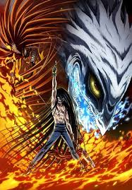

🐯 Ushio to Tora (うしおととら)
Ushio to Tora es un legendario manga y anime de acción y sobrenatural que sigue la explosiva alianza entre un joven impulsivo y un demonio milenario. 

  

⚔️ Sinopsis
La historia comienza cuando Ushio Aotsuki, un estudiante de secundaria, descubre a un temible monstruo atrapado en el sótano de su templo por la legendaria Lanza de la Bestia. Aunque al principio se niega a liberarlo, se ve obligado a hacerlo para salvar a sus amigos de una horda de espíritus malignos. 
Ushio bautiza al demonio como Tora, y juntos forman una dupla renuente pero devastadora. Mientras Tora intenta constantemente (y falla) comerse a Ushio, ambos deben aprender a trabajar en equipo para enfrentar al Hakumen no Mono, una entidad de pura maldad que amenaza con destruir todo Japón. 
⚡ Elementos Clave
La Lanza de la Bestia: Un arma sagrada que otorga un poder inmenso a cambio de consumir el alma del usuario.
Vínculo Forzado: Una química inmejorable basada en insultos, batallas épicas y una lealtad inesperada.
Folclore Japonés: Un desfile de yokais y leyendas tradicionales con giros oscuros y emocionantes.
"No te como hoy porque tienes la lanza, ¡pero mañana será otro día!" — Tora
📺 ¿Dónde verlo?
Puedes encontrar la adaptación moderna (2015) en plataformas como Crunchyroll o consultar detalles técnicos en MyAnimeList.